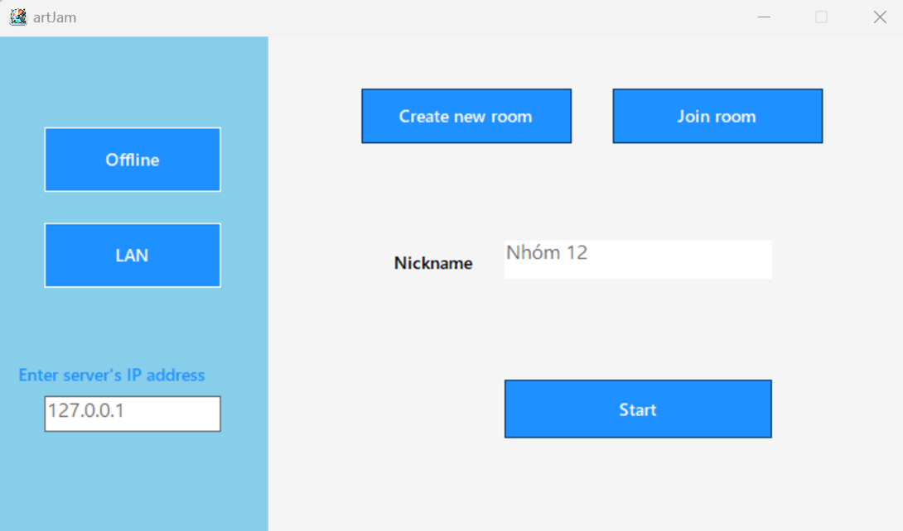
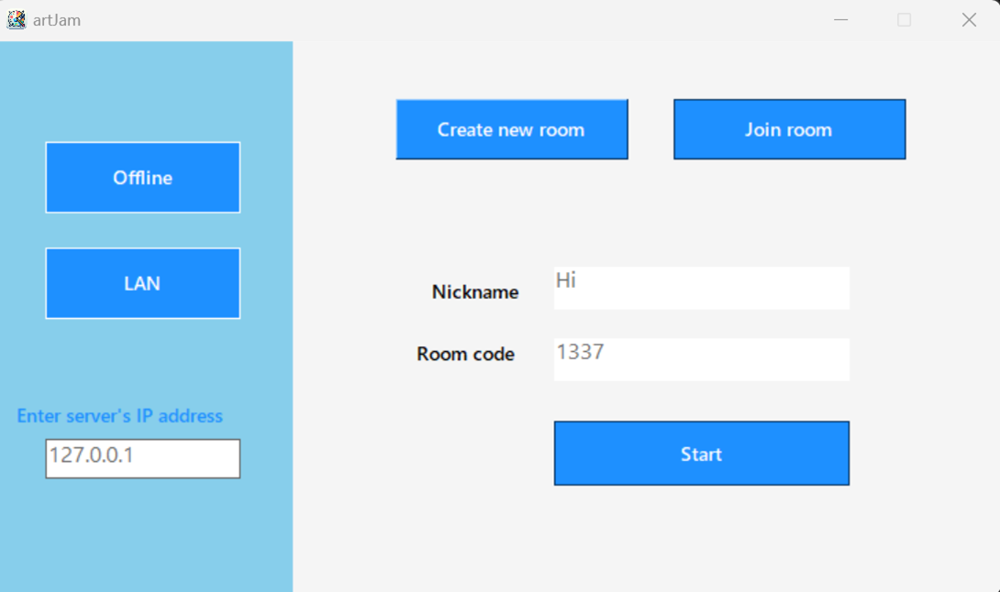
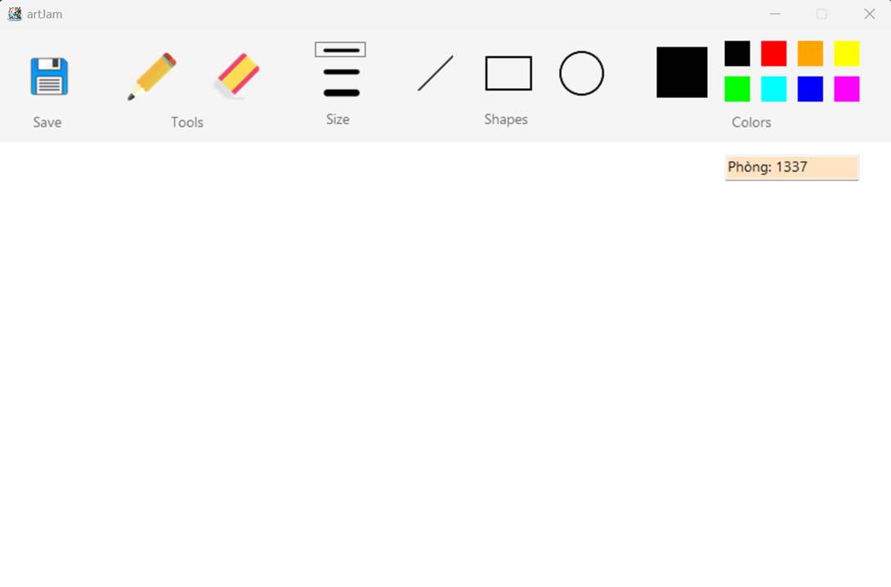
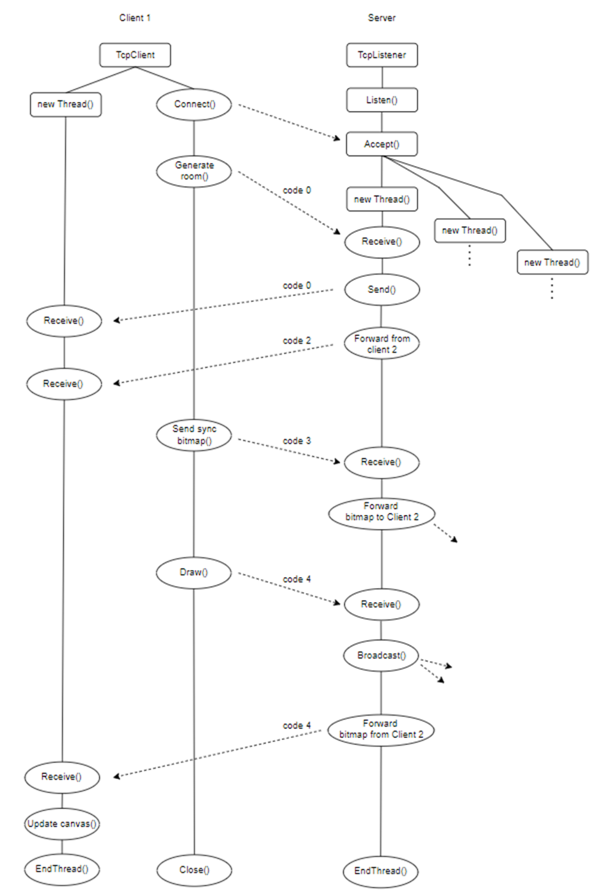
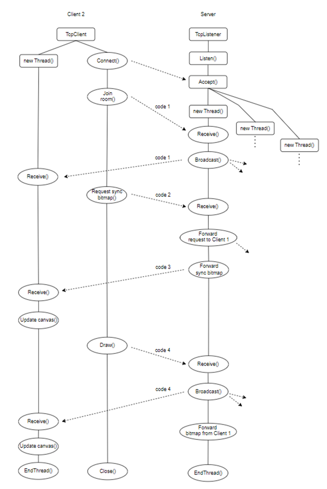

### GIỚI THIỆU
- Đây là repository của ứng dụng **artJam**, phục vụ cho đồ án môn học **Lập trình Mạng căn bản (NT106.O22)**.
- **artJam**: Ứng dụng vẽ cộng tác theo thời gian thực trong phạm vi mạng cục bộ. Những người dùng trong cùng một mạng cục bộ có thể kết nối với nhau để cộng tác chỉnh sửa bản vẽ, xem những thay đổi của nhau ngay lập tức và điều chỉnh ý tưởng theo hướng chung.
- Nhóm sinh viên thực hiện: Nhóm 12
    + Nguyễn Quốc An (22520023)
    + Nguyễn Đức Khang (22520618)
    + Bùi Thị Ngọc Trăm (22521497)

#### Giao diện ứng dụng
- Giao diện khi người dùng tạo phòng

- Giao diện khi người dùng tham gia phòng

- Giao diện bảng vẽ

#### Network stack
- Client 1:

- Client 2:

### QUY TẮC LÀM VIỆC TRÊN GITHUB
- Trước khi bắt đầu làm, kiểm tra nhánh master nếu có thay đổi thì pull về local
- Chỉ commit khi hoàn thành 1 chức năng / sửa xong 1 bug nào đó, không commit khi đang làm dở, không commit dồn
- Ghi rõ nội dung commit: tiếng Việt, có dấu
- Hoàn thành 1 task thì push vào branch của mình, không push vào master
- Khi muốn thay đổi được merge vào master, tạo pull request (đã cài Protection rules), sau đó nhờ một bạn trong nhóm review code và approve pull request
- Khi thực hiện một chức năng phức tạp hoặc sửa bug khó có thể tạo thêm branch từ nhánh của bản thân để làm. Sau khi làm xong thì merge vào nhánh gốc (không merge vào master) và xoá nhánh hiện tại đi

